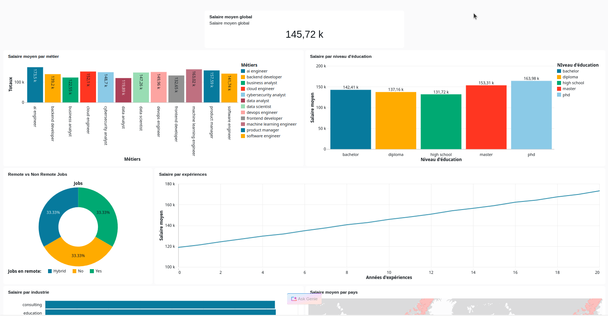

# Databricks Salary Analytics


Projet Data Lakehouse complet avec Databricks

**Points forts :**
- 250 000 lignes (Big Data crédible)
- Données structurées, variables business, target (salary)
- Pipeline professionnel : ingestion, nettoyage, analytics, ML
- Valorisation CV : Databricks, PySpark, Data Lakehouse, ETL, ML



## Structure du projet

```
databricks-salary-analytics/
│
├── notebooks/
│   ├── 01_bronze_ingestion.py   # Ingestion brute (Bronze)
│   ├── 02_silver_cleaning.py    # Nettoyage & typage (Silver)
│   ├── 03_gold_aggregation.py   # Agrégations analytiques (Gold)
│   ├── 04_salary_prediction.py  # Prédiction de salaire (ML)
│
├── data/                       # Données sources
├── README.md                   # Documentation
├── requirements.txt            # Dépendances Python
```


## Objectif
Construire un pipeline Data Lakehouse complet pour l’analyse et la prédiction de salaires avec Databricks.


## Pipeline & Étapes

### 1. 🟤 Bronze Layer (Raw)
**But :** Ingestion des données brutes
*Charger le CSV dans Databricks et stocker tel quel (Delta)*

```python
df = spark.read.csv("/FileStore/job_salary.csv", header=True, inferSchema=True)
df.write.format("delta").save("/mnt/bronze/jobs")
```

### 2. ⚪ Silver Layer (Cleaned)
**But :** Nettoyage et typage
*Suppression des nulls, typage, normalisation*

```python
df = spark.read.format("delta").load("/mnt/bronze/jobs")
df_clean = df.dropna()
df_clean.write.format("delta").mode("overwrite").save("/mnt/silver/jobs")
```

### 3. 🟡 Gold Layer (Analytics)
**But :** Agrégations business
*Salaire moyen par job, pays, expérience, etc.*

```python
df = spark.read.format("delta").load("/mnt/silver/jobs")
df_gold = df.groupBy("job_title").agg({"salary": "avg"})
df_gold.write.format("delta").mode("overwrite").save("/mnt/gold/jobs")
```

### 4. 🔥 Bonus ML (Prédiction)
**But :** Prédire le salaire à partir des variables business

```python
# Pipeline ML avec PySpark (RandomForestRegressor)
# Features : job_title, country, experience_level, education
# Target : salary
```
---


## Lancement sur Databricks

### 1. Importer le projet
- Uploade le dossier `notebooks/` sur ton workspace Databricks (via l’interface ou Databricks CLI)
- Place le fichier de données (ex : `job_salary.csv`) dans `/FileStore/` ou `/dbfs/data/`

### 2. Configurer le cluster
- Crée un cluster Databricks (runtime 11.x+ recommandé, support PySpark)
- Installe les dépendances si besoin (`requirements.txt`)

### 3. Exécuter les notebooks
1. Lance `01_bronze_ingestion.py` pour charger les données brutes
2. Lance `02_silver_cleaning.py` pour nettoyer et typer les données
3. Lance `03_gold_aggregation.py` pour générer les agrégations analytiques
4. (Optionnel) Lance `04_salary_prediction.py` pour entraîner le modèle ML

### 4. Visualiser les résultats
- Les données transformées sont stockées dans `/mnt/bronze/`, `/mnt/silver/`, `/mnt/gold/`
- Les modèles ML sont sauvegardés dans `/mnt/models/`

---

## Analyses possibles
- Salaire moyen par job
- Salaire vs expérience
- Salaire vs éducation
- Remote vs salary

## Lien Databricks
[Databricks Salary Analytics]https://dbc-8bc97cb2-8338.cloud.databricks.com/dashboardsv3/01f129c4e79e10b88d11feb13e791050/published?o=7474650928720376